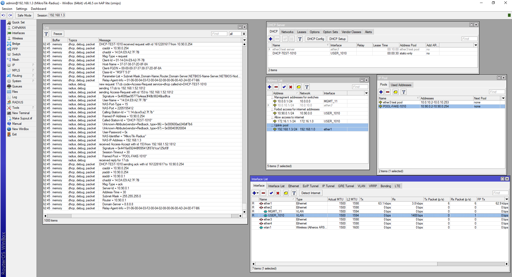

# All-Ok-Radius-Server
### Радиус-сервер для обработки DHCP-запросов. Используется для работы с DHCP-серверами микротика.

## Возможности    
#### ***API***    
* Получение данных через API (требуется реализация API, примеры запрос-ответ ниже)
* Работа со списком источников API (для резервирования и балансировки)   
* Проверка работоспособности и отключение неработающих API на определенные время     
* Кеширование ответов API (для уменьшения нагрузки и резервирования на случай недоступности всех API)
* Radreply и PostAuth запросы в API. 

#### ***Radius***     
* Чтение и передача в API следующих параметров: 
   * NAS-Identifier - Имя микротика    
   * NAS-IP-Address  - IP микротика    
   * User-Name - Мак-адрес пользователя    
   * Calling-Station-Id    
   * Called-Station-Id - Имя dhcp-сервера    
   * Agent-Remote-Id   
   * Agent-Circuit-Id    
* Парсинг Circuit-Id, Remote-Id (option82) и передача на апи 
   в виде remote_id, vlan_id, module, port. На данный момент поддерживается только оборудование от D-Link
* Радиус может выдавать пул или конкретный ip-адрес c указанием времени жизни лиза.    
#### ***Другое***
* Гибкое конфигурирование кеширования и актуализации работы с API    
* Поддержка передачи метрик в формате Prometheus (описание метрик смотрите в экспортере)
 
## Работа с API (Radreply)
Используется для получения информации о выдачи необходимого IP адреса. Данный метод должен возвращать 
**Сервер отправляет POST-запрос с Content-Type: application/json.**
* Пример запроса с передаваемой опцией82: 
```  
{
    "nas_ip": "10.0.0.1",
    "nas_name": "MikroTik-Radius",
    "device_mac": "00:01:02:03:04:05",
    "dhcp_server_name": "DHCP-TEST-101",
    "dhcp_server_id": "1:14:da:e9:a2:7f:7b",
    "agent": {
        "circuit_id": {
           "vlan_id": 101,
           "module": 0,
           "port": 3
        },
        "remote_id": "00:AD:24:0D:F7:B6",
        "_raw_circuit_id": "03f20005"
     }
}
```     
* Пример запроса без option82:     
```  
{
    "nas_ip": "10.0.0.1",
    "nas_name": "MikroTik-Radius",
    "device_mac": "00:01:02:03:04:05",
    "dhcp_server_name": "DHCP-TEST-101",
    "dhcp_server_id": "1:14:da:e9:a2:7f:7b",
    "agent": null
}
```

* Пример запроса с опцией, но ошибкой парсинга circuitId:     
```  
{
    "nas_ip": "10.0.0.1",
    "nas_name": "MikroTik-Radius",
    "device_mac": "00:01:02:03:04:05",
    "dhcp_server_name": "DHCP-TEST-101",
    "dhcp_server_id": "1:14:da:e9:a2:7f:7b",
    "agent": {
        "circuit_id": null,
        "remote_id": "00:AD:24:0D:F7:B6",
        "_raw_circuit_id": "03f20005"
    }
}
```
**Ответ от API должен быть в следующем формате**    
* Выдача пула с таймаутом лиза 2 минуты     
``` 
{
    "statusCode": 200,
    "data": {
        "pool_name": "INET-FAKE-101",
        "lease_time_sec": 120
    }
}
```    
* Выдача IP-адреса с таймаутом лиза на 1ч     
``` 
{
    "statusCode": 200,
    "data": {
        "ip_address": "172.16.3.233",
        "lease_time_sec": 3600
    }
}
```     

## Работа с API (PostAuth)     
**Сервер отправляет POST-запрос с Content-Type: application/json.**    
Пример запроса сервера:    
```
{
    "request": {
         "nas_ip": "<nil>",
         "nas_name": "", 
         "device_mac": "AA:BB:CC:DD:EE:FF",
         "dhcp_server_name":"vlan1244", "dhcp_server_id": "",
         "agent":null
    },
    "response": {
         "ip_address": "", 
         "pool_name": "vlan1244", 
         "lease_time_sec": 120,
         "status": "ACCEPT",
         "error":""
    }
}
```   
Радиус не анализирует ответ от API    


### Как запустить       
1. Можно использовать докер (описание находится в ./install/docker)    
2. Скачать бинарник с релизов и пример конфига. Можно запустить руками или же добавить в sysctl (описание находится в ./install/deamon)     

 
### Пример настройки микротика для опции82 или без нее 

