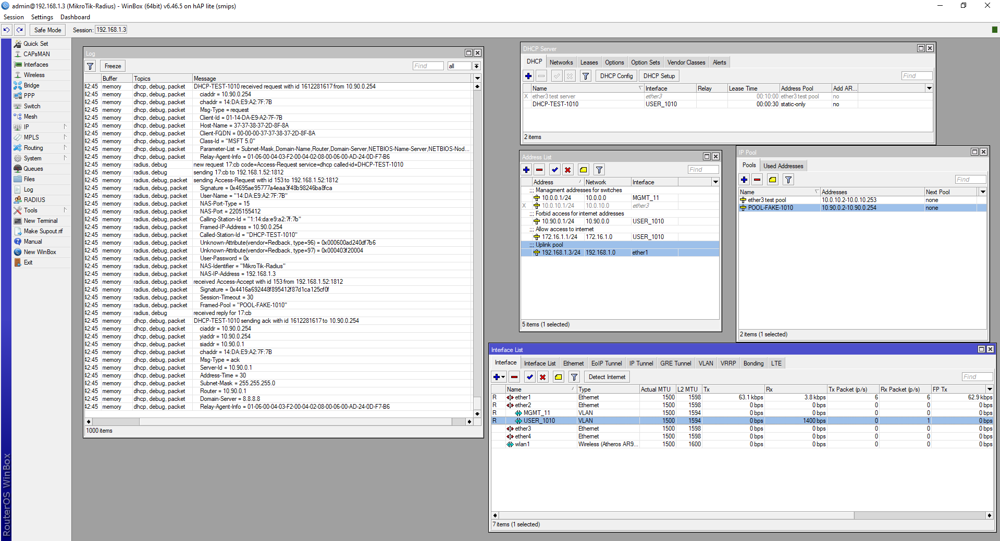

# DHCP-Radius-Server
### Radius-сервер для обробки DHCP-запитів. Використовується для роботи з DHCP-серверами мікротика.

## Можливості    
#### ***API***    
* Отримання даних через API (потрібна реалізація API, приклади запит-відповідь нижче)
* Робота зі списком джерел API (для резервування і балансування)   
* Перевірка працездатності та відключення непрацюючих API на певний час     
* Кешування відповідей API (для зменшення навантаження і резервування на випадок недоступності всіх API)
* Radreply і PostAuth запити в API
* Accounting requests

#### ***Radius***     
* Читання і передача в API наступних параметрів: 
   * NAS-Identifier - Ім'я мікротика    
   * NAS-IP-Address  - IP мікротика    
   * User-Name - Мак-адреса користувача    
   * Calling-Station-Id    
   * Called-Station-Id - Ім'я dhcp-сервера    
   * Agent-Remote-Id   
   * Agent-Circuit-Id    
* Парсинг Circuit-Id, Remote-Id (option82) і передача на апі 
   у вигляді remote_id, vlan_id, module, port. На даний момент підтримується тільки обладнання від D-Link
* Radius може видавати пул або конкретну ip-адресу з вказанням часу життя лізу.    
#### Changelog
Зміни можна переглянути тут - [CHANGELOG.md](CHANGELOG.md)

#### ***Вбудовані Lua-скрипти***
* Обробка auth/accounting/post-auth запитів вбудованими Lua-скриптами замість HTTP API 
   (за аналогією з lua-nginx-module в nginx або rlm_python у FreeRADIUS)    
* На кожен метод - свій скрипт (`script.auth`/`script.acct`/`script.post_auth`), так само як у API свій список `addresses` на кожен метод    
* Скрипти компілюються один раз при старті і виконуються в пулі ізольованих станів,
   без мережевих звернень і без зовнішніх процесів   
* Вибір обробника єдиний (`processor: api` або `script`) - або все через HTTP API, або все через скрипт;
   пакети api і script повністю незалежні один від одного    

#### ***Інше***
* Гнучке конфігурування кешування і актуалізації роботи з API    
* Підтримка передачі метрик у форматі Prometheus (опис метрик дивіться в експортері)
 
## Робота з API (Radreply)
Використовується для отримання інформації про видачу потрібної IP-адреси. Даний метод повинен повертати
**Сервер відправляє POST-запит з Content-Type: application/json.**
* Приклад запиту з переданою опцією82: 
```  
{
    "nas_ip": "10.0.0.1",
    "nas_name": "MikroTik-Radius",
    "device_mac": "00:01:02:03:04:05",
    "dhcp_server_name": "DHCP-TEST-101",
    "dhcp_server_id": "1:14:da:e9:a2:7f:7b",
    "agent": {
        "circuit_id": {
           "vlan_id": 101,
           "module": 0,
           "port": 3
        },
        "remote_id": "00:AD:24:0D:F7:B6",
        "_raw_circuit_id": "03f20005"
     }
}
```     
* Приклад запиту без option82:     
```  
{
    "nas_ip": "10.0.0.1",
    "nas_name": "MikroTik-Radius",
    "device_mac": "00:01:02:03:04:05",
    "dhcp_server_name": "DHCP-TEST-101",
    "dhcp_server_id": "1:14:da:e9:a2:7f:7b",
    "agent": null
}
```

* Приклад запиту з опцією, але помилкою парсингу circuitId:     
```  
{
    "nas_ip": "10.0.0.1",
    "nas_name": "MikroTik-Radius",
    "device_mac": "00:01:02:03:04:05",
    "dhcp_server_name": "DHCP-TEST-101",
    "dhcp_server_id": "1:14:da:e9:a2:7f:7b",
    "agent": {
        "circuit_id": null,
        "remote_id": "00:AD:24:0D:F7:B6",
        "_raw_circuit_id": "03f20005"
    }
}
```
**Відповідь від API повинна бути в наступному форматі**    
* Видача пулу з таймаутом лізу 2 хвилини     
``` 
{
    "statusCode": 200,
    "data": {
        "pool_name": "INET-FAKE-101",
        "lease_time_sec": 120
    }
}
```    
* Видача IP-адреси з таймаутом лізу на 1год     
``` 
{
    "statusCode": 200,
    "data": {
        "ip_address": "172.16.3.233",
        "lease_time_sec": 3600
    }
}
```     

## Робота з API (PostAuth)     
**Сервер відправляє POST-запит з Content-Type: application/json.**    
Приклад запиту сервера:    
```
{
    "request": {
         "nas_ip": "<nil>",
         "nas_name": "", 
         "device_mac": "AA:BB:CC:DD:EE:FF",
         "dhcp_server_name":"vlan1244", "dhcp_server_id": "",
         "agent":null
    },
    "response": {
         "ip_address": "", 
         "pool_name": "vlan1244", 
         "lease_time_sec": 120,
         "status": "ACCEPT",
         "error":""
    }
}
```   
Radius не аналізує відповідь від API    


## Робота з API (Accounting)     
**Сервер відправляє POST-запит з Content-Type: application/json.**    
Структура:    
```
struct {
	string `json:"nas_ip" 
	string `json:"nas_name"  
	string `json:"device_mac"`
	string `json:"dhcp_server_name"`
	string `json:"dhcp_server_id"`
	string `json:"ip_address"`
	string `json:"auth_type"`
	string `json:"class_id"`
	string `json:"status_type"`
	int64  `json:"session_time"`
	string `json:"terminate_cause"`
	int64  `json:"input_octets"`
	int64  `json:"output_octets"`
	string `json:"pool_name"`
	string `json:"session_id"`
}

```   
Radius не аналізує відповідь від API    

## Вбудовані Lua-скрипти (альтернатива HTTP API)
Замість HTTP API запити можна обробляти вбудованими Lua-скриптами - вони виконуються прямо в
процесі radius-сервера, без мережевих звернень, за аналогією з lua-nginx-module в nginx або
rlm_python у FreeRADIUS. Кожен скрипт компілюється один раз при старті і потім виконується в
пулі з `script.pool_size` ізольованих станів (по одному на одночасний виклик).

Це вибір **або/або** на верхньому рівні конфігу: `processor: api` або `processor: script` -
методи не можуть використовувати різні бекенди одночасно. При цьому пакети `api` і `script` нічого
не знають один про одного - це дві незалежні реалізації одного інтерфейсу, між ними обирає
тільки `server/main.go` за значенням `processor`.

Для кожного методу - свій Lua-файл, так само як у HTTP API свій список `addresses` на кожен метод:
`script.auth` (обов'язковий), `script.acct` і `script.post_auth` (опціональні - якщо шлях не задано,
метод просто не обробляється скриптом). Можна вказати один і той же файл для декількох методів.

**Важливо:** зараз вся бізнес-логіка (парсинг circuit_id/remote_id з option82, пошук клієнта по
MAC/агенту і т.п.) реалізована на стороні HTTP API. При переході на `processor: script` скрипт
отримує ті самі сирі дані, що раніше йшли в API (див. `option.remote_id`, `option.circuit_id`
в request нижче) - її потрібно реалізувати в скрипті самостійно, HTTP API при цьому не бере участі.

Приклади скриптів - [script/examples/auth.lua](script/examples/auth.lua), [acct.lua](script/examples/acct.lua), [post_auth.lua](script/examples/post_auth.lua).
`auth.lua` - робочий приклад: парсинг option82 під BDCOM/D-Link/ZTE/Edgecore і видача
ip/пулу на основі `db`. Тип обладнання для парсингу circuit_id береться з
`db:getDeviceByMac(mac_sw).parse_type` (поле `parse_type` з `script.database.devices_url`).

**`script.database` обов'язковий при `processor: script`** - без бази пристроїв скрипти не
зможуть працювати з option82, сервер не запуститься (`script.database.devices_url не задан`).

```yaml
processor: script
script:
  pool_size: 10
  timeout: 3s
  auth: /etc/radius/scripts/auth.lua           # authorize(request) -> table
  acct: /etc/radius/scripts/acct.lua           # accounting(request)
  post_auth: /etc/radius/scripts/post_auth.lua # post_auth(request, response)
  # Обов'язково при processor: script - база пристроїв/прив'язок, доступна в скриптах через db
  # Адреса бази задається через змінну оточення (${VAR} в конфізі підставляється з env), в конфізі не зберігається
  database:
    devices_url: ${CLIENTDB_URL}?type=devices # обов'язкове
    binds: # довільний набір іменованих джерел прив'язок
      clients: ${CLIENTDB_URL}?type=binds
      smart: ${CLIENTDB_URL}?type=smart
    refresh_interval: 5m
    timeout: 30s
    # Опціонально: точкові upsert/delete однієї прив'язки binds по id через redis pub/sub,
    # на додачу до повного refresh_interval-reload по HTTP вище. Якщо addr не задано - не використовується
    redis:
      addr: ${CLIENTDB_REDIS_ADDR}
      channel: clientdb-bind-events
```

Кожен файл може визначати тільки потрібну йому функцію - `authorize` для `script.auth`,
`accounting` для `script.acct`, `post_auth` для `script.post_auth`. Якщо функція відсутня в
зазначеному файлі - сервер не запуститься і явно вкаже на це в логу.
* `authorize(request) -> table` - повинна повернути таблицю з `ip_address` або `pool_name`
  (опціонально `lease_time_sec`), або `{error = "..."}` для відмови
* `accounting(request)` - без значення, що повертається
* `post_auth(request, response)` - повідомлення про фінальну відповідь, відправлену NAS-у, без
  значення, що повертається

Поля `request` для auth збігаються з тілом HTTP-запиту Radreply (див. вище): `nas_ip`, `nas_name`,
`device_mac`, `dhcp_server_name`, `dhcp_server_id`, `ip_address`, `class_id`,
`option.remote_id`, `option.circuit_id`. Поля `request` для accounting/post_auth аналогічні
структурам Accounting/PostAuth вище.

Всередині скрипта доступний глобальний об'єкт `log` (`log.debug/info/notice/warning/error(msg)`) -
пише в загальний лог radius-сервера.

### База пристроїв/прив'язок (`db`)

`script.database` **обов'язковий** при `processor: script` (сервер не запуститься без нього) -
всередині скрипта глобальний об'єкт `db` присутній завжди, перевіряти `if db then` не потрібно.

**Принцип роботи.** При старті `clientdb` синхронно (fail-fast) завантажує `devices_url` і
всі джерела з `binds` - якщо хоч одне недоступне або відповідає не 200, сервер не
стартує. Далі раз на `refresh_interval` (за замовчуванням 5m) весь набір даних перезапитується
цілком і підміняється в пам'яті одним атомарним знімком - читання з Lua ніколи не блокуються
і ніколи не бачать наполовину оновлений стан. Дані повністю замінюються на кожне
оновлення, застарілі записи автоматично зникають. **Якщо хоч одне джерело (devices або
будь-яке з binds) в черговому циклі недоступне/повернуло не 200/перевищило `timeout` - весь цикл
оновлення скасовується цілком, залишаються старі дані по всіх джерелах** (не тільки по
несправному), помилка йде в лог. Метрика `rad_clientdb_last_reload_timestamp_seconds`
перестає рости, поки не пройде успішний reload - зручно на неї вішати алерт на "вік" бази.

**Точкові оновлення binds через redis (опціонально).** На додачу до повного reload вище,
`clientdb` вміє підписуватись на канал redis pub/sub (`script.database.redis`, див. приклад
конфігу вище) і застосовувати одиничні `upsert`/`delete` по конкретному `id` запису, не
чіпаючи решту binds і не роблячи повний reload. Повідомлення в каналі - JSON:
`{"db":"clients","action":"upsert","line":"id;ip;client_mac;device_mac;port"}` (`line` - той
самий формат рядка, що й у HTTP-джерелі, див. нижче) або `{"db":"clients","action":"delete","id":"..."}`.
`db` повинен збігатися з одним із ключів `script.database.binds` - подія для незнайомого
джерела ігнорується з помилкою в лозі. Це не заміна повного reload, а доповнення для меншої
затримки - наступний плановий reload все одно повністю перезапитає джерело і є єдиним, хто
насправді прибирає застарілі записи "за замовчуванням" (якщо зовнішня система не надіслала
відповідний `delete`).

**Рекомендації з реалізації API бази (що і в якому форматі віддавати):**

* **Транспорт** - звичайний `GET`, без авторизації/заголовків з боку radius-сервера. Відповідь
  повинна бути `HTTP 200` і вкластися в `script.database.timeout` цілком (включно з читанням тіла) -
  виставляйте `timeout` із запасом, якщо джерело віддає сотні тисяч рядків.
* **Тіло відповіді** - звичайний текст, кодування ASCII/UTF-8, один запис на рядок (`\n` або
  `\r\n`), поля всередині рядка розділені `;`. Обмеження - **один рядок не довший 1 МБ**
  (якщо рядок довший - reload цілком падає з помилкою). Порожні рядки пропускаються.
  Стрімити порядково можна, буферизувати все тіло цілком на стороні API не обов'язково.
* **IP-адреса у всіх форматах (devices і binds) - не рядок `"1.2.3.4"`, а IPv4, упакований
  у 4 байти big-endian і записаний як ОДНЕ десяткове число** (`ip = a*16777216 + b*65536 +
  c*256 + d`). Наприклад `1.2.3.4` → `16909060`. Це найчастіша помилка при підключенні нової
  бази - якщо IP не резолвиться, перевірте в першу чергу саме це поле.
* **Мак-адреси** - в будь-якому написанні (`AA:BB:CC:DD:EE:FF`, `AA-BB-...`, `aabb.ccdd.eeff`,
  злито `AABBCCDDEEFF`, в будь-якому регістрі) - при завантаженні вони нормалізуються (всі не-hex символи
  прибираються, букви приводяться до верхнього регістру), так що формат на стороні API можна обрати
  довільний, однаковості не потрібно.

**`devices_url`** - один рядок на пристрій (світч/OLT), формат:

```
ip;device_mac;parse_type
```

Потрібні мінімум 3 поля (зайві - ігноруються). `parse_type` - довільний рядок, для самого
`clientdb` він непрозорий (просто зберігається і віддається як є) - його розуміння і розбір
цілком на совісті скрипта (`db:getDeviceByMac(mac).parse_type`, порівняння в скрипті
регістронезалежне). Якщо `device_mac` зустрічається декілька разів - в базі залишиться
тільки останній рядок з цим маком.

**`binds.<name>`** (довільна кількість іменованих джерел, наприклад `clients`/`smart`) -
один рядок на прив'язку, підтримуються два формати:

```
id;ip;client_mac                      # без пристрою і порту, наприклад "smart"
id;ip;client_mac;device_mac;port      # повна прив'язка, наприклад "clients"
```

`id` - унікальний в межах джерела ключ запису у зовнішньої системи (довільний непорожній
рядок, наприклад той самий, що первинний ключ у БД джерела). По ньому застосовуються точкові
`upsert`/`delete` через redis pub/sub (див. вище) - без `id` рядок не розбирається і
пропускається. Дублікат `id` в одному джерелі трактується як заміна - лишається останній
рядок з цим `id`.

Потрібно **рівно 3 або рівно 5+ полів** - рядок з 4 полями не є окремим форматом:
`device_mac`/`port` з нього просто не будуть розібрані (запис поводиться як 3-польний).
`port` повинен бути додатним цілим числом - `0`, порожнє значення або нечислове рядок
мовчки перетворюються на `0`, і такий запис стає недосяжним через пошук по
`device_mac+port` (це ламає логіку загальних пулів на порту - `db:getBind("clients", "",
device_mac, port)` без мак-адреси клієнта). Повторювані `client_mac` в одному джерелі -
це нормально і навмисно підтримується (декілька прив'язок на одному порту/пристрої,
декілька пристроїв у одного клієнта) - записи не дедуплікуються, всі зберігаються.

Всередині скрипта доступний глобальний об'єкт `db`:
* `db:getDeviceByMac(mac) -> {ip, mac, parse_type} | nil`
* `db:getBind(db_name, mac, [device_mac], [port]) -> array` - `db_name` - ключ з
  `script.database.binds` (наприклад `"clients"` або `"smart"`); `device_mac` і `port`
  опціональні і уточнюють пошук (мак клієнта; мак клієнта + мак пристрою; мак клієнта +
  мак пристрою + порт; або, якщо `mac` не задано - `device_mac`+`port` без прив'язки до
  конкретного клієнта, для перевірки "весь порт відданий під загальний пул"). Завжди повертає
  масив (порожній, якщо нічого не знайдено) - під одним мак-адресом клієнта може бути
  декілька прив'язок.

### Як запустити       
1. Можна використовувати docker (опис знаходиться в ./install/docker)    
2. Завантажити бінарник з релізів і приклад конфігу. Можна запустити руками або ж додати в sysctl (опис знаходиться в ./install/deamon)     

### Інтеграції з білінгами
* NoDeny - https://github.com/meklis/all-ok-radius-nodeny-lib   
* AllOkBilling   
### Приклад налаштування мікротика для опції82 або без неї 

